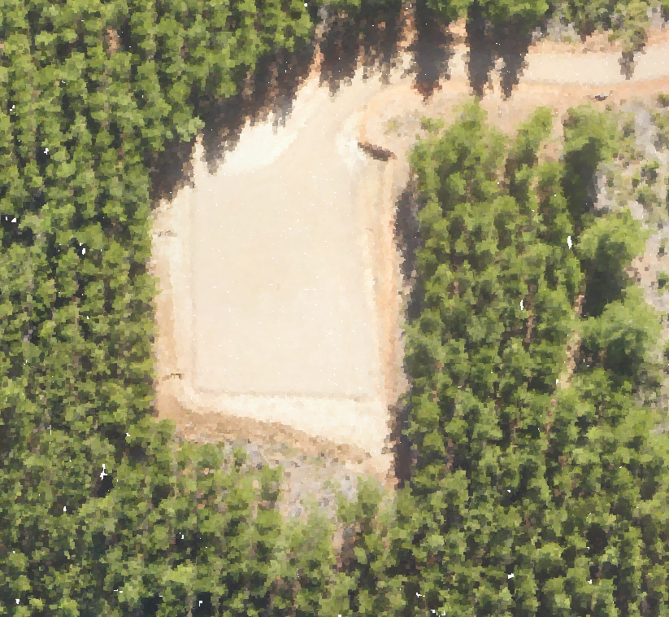
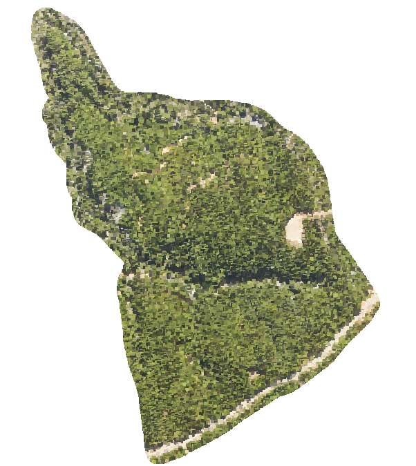

# lidar-fusion — LiDAR + Imagery Fusion / Fusión LiDAR + Imagen

Fuse the geometric precision of airborne LiDAR with the spectral
information of imagery. Stage 1 colorizes a point cloud from a
georeferenced orthomosaic — each LiDAR point takes the real RGB
of the pixel it falls on — turning an XYZ cloud into a
photo-realistic 3D model.

*Fusiona la precisión geométrica del LiDAR aerotransportado con la
información espectral de la imagen. La Etapa 1 coloriza una nube de
puntos desde un ortomosaico georreferenciado — cada punto LiDAR toma
el RGB real del píxel donde cae — convirtiendo una nube XYZ en un
modelo 3D foto-realista.*


*Managed forest, south-central Chile (U0333): 67M points, LiDAR
geometry + orthomosaic RGB. Bosque manejado, centro-sur de Chile:
67M de puntos, geometría LiDAR + RGB del ortomosaico.*

## Why this matters / Por qué importa

LiDAR gives you precise 3D structure but no colour or spectral
information; imagery gives you rich colour but no reliable 3D. Fusing
them is where 2026's most useful reality-capture work lives — species
discrimination, live-vs-dead vegetation, health mapping in 3D. This
repo builds that fusion from the ground up, starting with colorization
and a reusable per-point raster sampler that scales to vegetation
indices and (in future) multispectral/hyperspectral data.

*El LiDAR da estructura 3D precisa pero sin color ni información
espectral; la imagen da color rico pero sin 3D confiable. Fusionarlos
es donde está el trabajo de reality-capture más útil de 2026 —
discriminación de especies, vegetación viva vs. seca, mapas de salud
en 3D. Este repo construye esa fusión desde la base, empezando por la
colorización y un muestreador de ráster por punto reutilizable que
escala a índices de vegetación y (a futuro) datos
multiespectrales/hiperespectrales.*


*Managed forest, south-central Chile (U0333): LiDAR geometry + orthomosaic RGB, 67M points. / Bosque manejado, centro-sur de Chile: geometría LiDAR + RGB del ortomosaico, 67M de puntos.*



# lidar-fusion

Fuse raster information into a LiDAR point cloud. **Stage 1 (this release):
colorization** — paste the RGB of an orthomosaic onto every point of a cloud in
the same CRS.

*Fusiona informacion raster en una nube de puntos LiDAR. **Etapa 1 (esta
entrega): colorizacion** — pegar el RGB de un ortomosaico a cada punto de una
nube en el mismo CRS.*

---

## EN

### What it does

`run_colorize.py` reads a LAS/LAZ cloud in chunks, maps each point's X,Y to a
row/column of the orthomosaic through the raster's affine transform, reads the
pixel, and writes a new cloud with **identical geometry and classification** plus
populated `Red`/`Green`/`Blue` dimensions.

| File | Role |
|---|---|
| `config.yaml` | Project: cloud path, raster path, expected CRS, bands, no-colour policy, output. |
| `raster_sampler.py` | **Reusable core.** `RasterSampler.sample(x, y) -> (values, valid)`. Knows nothing about colour: it samples *any* raster at *any* XY. |
| `run_colorize.py` | Stage-1 engine: validation, chunked read/write, report + manifest. |

### Usage

```bash
conda env create -f environment.yml
conda activate lidar-fusion
python run_colorize.py config.yaml --dry-run   # validate + report, write nothing
python run_colorize.py config.yaml             # colorize
```

### Validation before touching a single point

The run aborts (exit 2) with a clear message if: a path does not exist; the
cloud or the raster declares a CRS other than `crs:` in the config (no
reprojection is attempted — silent reprojection is how you get a cloud 300 m off
its colours); the two bounding boxes do not intersect; the config asks for a band
the raster does not have; or the input point format has no RGB-capable
counterpart.

### Output point format

RGB needs a point format that has it. The input format is mapped to the smallest
format that carries the same fields **plus** colour:

| in | out | |
|---|---|---|
| 0 | 2 | |
| 1 | 3 | keeps GPS time — **the U0333 case** |
| 6 | 7 | |
| 7, 8 | 7, 8 | already colour-capable |

Scales, offsets and the CRS VLR of the input are preserved. The LAS version is
too — **except under `flag`**: the `color_valid` extra dimension travels in an
ExtraBytes VLR, which is only standard from **LAS 1.4** on, and PDAL silently
ignores it in a 1.2 file. So `flag` bumps the output to 1.4 (U0333: 1.2 -> 1.4).

**8-bit rasters are scaled to the 16-bit LAS colour range (×257)**, which is what
the spec intends and what CloudCompare/QGIS expect; the manifest records the
factor.

### Orthomosaic resolution vs cloud density

These are two different samplings of the same ground and they rarely match. In
U0333 the mosaic is 15 cm/px (44.4 px/m²) and the cloud is ~94 pts/m², so **~2.1
points share each pixel** — colour is coarser than geometry, and a point 5 cm
away from its neighbour can only be given the same colour. Sampling is
nearest-neighbour by design: no interpolation invents colour that the sensor did
not see. Read the ratio in `out/reporte_colorize.md` before drawing conclusions
from colour at point scale.

The reverse case matters too: a mosaic much finer than the cloud (e.g. 2 cm/px)
means most pixels are never sampled — the cloud simply cannot carry that detail.

### Points with no valid colour

A point has no valid colour if it falls **outside** the raster, on a **nodata**
pixel, or on a pixel whose **alpha < `alpha_min`** (the transparent skirt around
a flight). Policy is set with `no_color_policy`:

| Policy | Effect |
|---|---|
| `flag` *(default)* | RGB = (0,0,0) **and** an extra dimension `color_valid` (uint8, 1/0). Nothing is lost, and downstream filters can exclude the uncoloured points. |
| `skip` | RGB = (0,0,0), no flag. Lighter, but black is then ambiguous with a genuinely black pixel. |
| `drop` | The point is excluded from the output. The cloud is no longer geometrically complete — use only when the uncoloured points are noise. |

### How it grows: from raw RGB to per-point indices

`RasterSampler` is deliberately index-agnostic — `sample()` returns raw band
values and a validity mask for *any* raster. Fusing a vegetation index instead of
colour is the same mechanism with a different raster and a different write step:

1. **Indices from RGB** (ExG, TGI) — computable from the same 3 bands, either by
   sampling the mosaic and doing the arithmetic per point, or by sampling an
   index raster already produced by `agronomia/run_indices.py`.
2. **Indices from multispectral** (NDVI, NDRE) — point the sampler at the index
   GeoTIFF, sample 1 band, write it into an extra dimension instead of RGB.

What stays fixed: validation, chunked traversal, the no-valid-value policy, the
report. What changes: which raster, which bands, which dimension is written.

---

## ES

### Que hace

`run_colorize.py` lee una nube LAS/LAZ por bloques, mapea el X,Y de cada punto a
fila/columna del ortomosaico mediante el transform del raster, lee el pixel y
escribe una nube nueva con **la misma geometria y clasificacion** mas las
dimensiones `Red`/`Green`/`Blue` pobladas.

| Fichero | Rol |
|---|---|
| `config.yaml` | Proyecto: ruta de la nube, del ortomosaico, CRS esperado, bandas, politica sin-color, salida. |
| `raster_sampler.py` | **Nucleo reutilizable.** `RasterSampler.sample(x, y) -> (valores, validos)`. No sabe nada de color: muestrea *cualquier* raster en *cualquier* XY. |
| `run_colorize.py` | Motor de la etapa 1: validacion, lectura/escritura por bloques, reporte + manifest. |

### Uso

```bash
conda env create -f environment.yml
conda activate lidar-fusion
python run_colorize.py config.yaml --dry-run   # valida y reporta, no escribe nada
python run_colorize.py config.yaml             # coloriza
```

### Validacion antes de tocar un solo punto

La corrida aborta (exit 2) con mensaje claro si: falta un fichero; la nube o el
raster declaran un CRS distinto al `crs:` del config (no se reproyecta: reproyectar
en silencio es como terminas con una nube 300 m corrida respecto de su color);
los bounding boxes no se intersectan; el config pide una banda que el raster no
tiene; o el point format de entrada no tiene equivalente con RGB.

### Point format de salida

El RGB exige un point format que lo soporte. El formato de entrada se mapea al
formato minimo que conserva los mismos campos **y ademas** color:

| entra | sale | |
|---|---|---|
| 0 | 2 | |
| 1 | 3 | conserva GPS time — **el caso U0333** |
| 6 | 7 | |
| 7, 8 | 7, 8 | ya soportan color |

Se preservan escalas, offsets y el VLR de CRS del input. La version LAS tambien
— **salvo con `flag`**: la dimension extra `color_valid` viaja en un VLR
ExtraBytes, que solo es estandar desde **LAS 1.4**, y PDAL lo ignora en silencio
en un fichero 1.2. Por eso `flag` sube la salida a 1.4 (U0333: 1.2 -> 1.4).

**Los
rasters de 8 bits se escalan al rango de color de 16 bits del LAS (×257)**, que
es lo que dice la especificacion y lo que esperan CloudCompare/QGIS; el manifest
registra el factor.

### Resolucion del ortomosaico vs densidad de la nube

Son dos muestreos distintos del mismo terreno y casi nunca coinciden. En U0333 el
mosaico es de 15 cm/px (44.4 px/m²) y la nube tiene ~94 pts/m²: **~2.1 puntos
comparten cada pixel** — el color es mas grueso que la geometria, y a un punto a
5 cm de su vecino solo se le puede dar el mismo color. El muestreo es
nearest-neighbour a proposito: no se interpola color que el sensor no vio. Mira la
relacion en `out/reporte_colorize.md` antes de sacar conclusiones del color a
escala de punto.

El caso inverso tambien importa: un mosaico mucho mas fino que la nube (p. ej. 2
cm/px) significa que la mayoria de los pixeles nunca se muestrean — la nube no
puede cargar ese detalle.

### Puntos sin color valido

Un punto no tiene color valido si cae **fuera** del raster, en un pixel
**nodata**, o en un pixel con **alpha < `alpha_min`** (la orla transparente
alrededor del vuelo). La politica se fija en `no_color_policy`:

| Politica | Efecto |
|---|---|
| `flag` *(default)* | RGB = (0,0,0) **y** una dimension extra `color_valid` (uint8, 1/0). No se pierde nada y aguas abajo se pueden filtrar los puntos sin color. |
| `skip` | RGB = (0,0,0), sin flag. Mas ligero, pero el negro se vuelve ambiguo con un pixel genuinamente negro. |
| `drop` | El punto se excluye de la salida. La nube deja de ser geometricamente completa — usar solo si los puntos sin color son ruido. |

### Como crece: de RGB crudo a indices por punto

`RasterSampler` es agnostico al indice a proposito — `sample()` devuelve valores
de banda crudos y una mascara de validez para *cualquier* raster. Fusionar un
indice de vegetacion en vez de color es el mismo mecanismo con otro raster y otra
escritura:

1. **Indices desde RGB** (ExG, TGI) — se calculan con las mismas 3 bandas, ya sea
   muestreando el mosaico y haciendo la aritmetica por punto, o muestreando un
   raster de indice ya generado por `agronomia/run_indices.py`.
2. **Indices desde multiespectral** (NDVI, NDRE) — se apunta el sampler al
   GeoTIFF del indice, se muestrea 1 banda y se escribe en una dimension extra en
   vez de RGB.

Lo que no cambia: validacion, recorrido por bloques, politica de valor no valido,
reporte. Lo que cambia: que raster, que bandas, que dimension se escribe.
